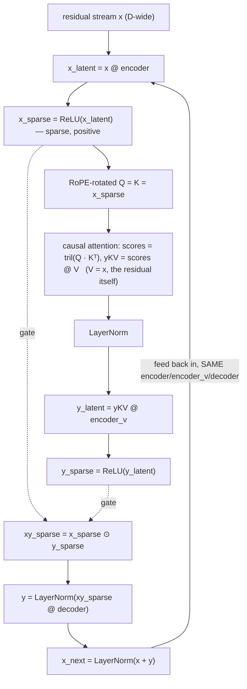
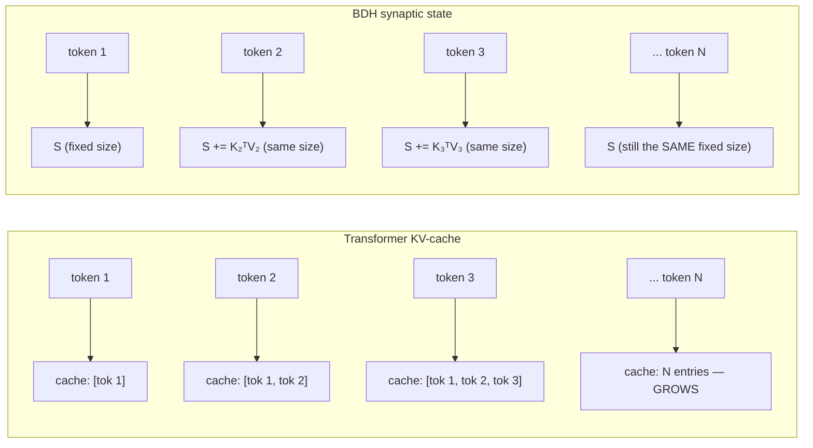
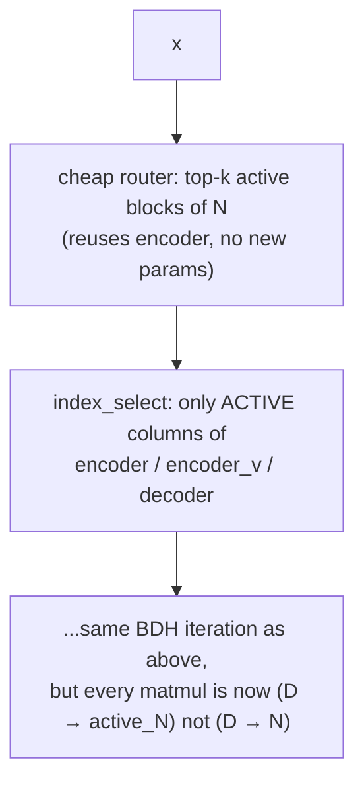
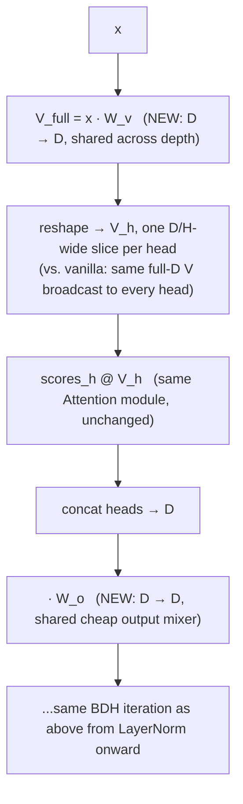

# HatchlingZero

**A research program testing whether a byte-faithful Dragon Hatchling (BDH) core — persistent synaptic state, shared/tied iterative weights, sparse positive neuronal activity — can replace a meaningful fraction of a conventional Transformer's static parameter count and dense computation, without losing quality.**

HatchlingZero (`HZ`) starts from two trusted, byte-faithful foundations — the official `bdh.py` and `train.py` from [`pathwaycom/bdh`](https://github.com/pathwaycom/bdh), verified line-by-line against fresh, complete, verbatim fetches of the upstream source — and builds every extension on top of that oracle, not from a summary or a hand-transcription. The central question: **can dynamic state, reused weights, and sparse computation replace a large fraction of the static parameters and repeated dense computation a Transformer uses, while matching its quality per parameter, RAM, energy, and inference speed?**

We do not assume the answer is yes. The most complete real, matched, same-hardware test in this repo so far (Phase F, ~25.4M params — see "Where the project stands" below) says **it's split, not yes or no**: BDH wins on quality decisively, the Transformer wins on training cost decisively (~5.3× faster, ~10-11× less RAM, ~6.2× more energy-efficient per token), and a real attempt to close that cost gap with a fused GPU kernel made it worse, not better, for a real, understood reason. That is the standard every claim here is held to: a same-shape control, a real run, and the result reported as measured — including the parts that don't favor BDH.

---

## Table of contents

- [Philosophy](#philosophy)
- [Where the project stands](#where-the-project-stands)
- [The trusted foundation](#the-trusted-foundation)
- [Architecture: how BDH actually works](#architecture-how-bdh-actually-works)
- [Real evidence so far](#real-evidence-so-far)
- [The research plan](#the-research-plan)
- [Prior work (HZ-0A – HZ-0H, superseded direction)](#prior-work-hz-0a--hz-0h-superseded-direction)
- [Repository layout](#repository-layout)
- [Getting started](#getting-started)
- [Branching model](#branching-model)
- [Documentation](#documentation)
- [License](#license)

---

## Philosophy

Three rules govern every stage of this project:

1. **Real evidence over plausible narrative.** Every architectural claim ships with a same-shape control, a real dataset, and a result — including the ones that don't favor the new mechanism. A run that loses to a fair baseline is reported as losing.
2. **Isolate before you integrate.** Each mechanism is built, tested, and evaluated on its own before it is wired into the rest of the stack. Cross-mechanism interactions are tested explicitly, not assumed.
3. **Ground claims in the real upstream source, not a summary of it.** Three real, independently-confirmed bugs this project shipped and then caught (a degenerate training-target convention, a missing RoPE unit conversion, a missing embedding-init override) all trace back to building from a remembered/summarized reading of `bdh.py` instead of a fresh, complete, verbatim one. The fix was a byte-faithful rewrite (`reference/hz0h_bdh_torch.py`), diffable line-by-line against upstream — not another round of patching a hand-port.

This shows up directly in the evidence trail: `docs/restart/` holds dozens of results documents, and a non-trivial fraction of them report a technique, or a comparison, that **did not** go the way it was expected to — with the reasoning and the numbers behind why.

---

## Where the project stands

HatchlingZero's direction changed on 2026-08-11. The project's first ~7 stages (`HZ-0A` through `HZ-0H`, summarized below) explored a hand-built hybrid backbone accumulating recurrence, memory, triggered attention, fast weights, and MoE — real, evidence-based, individually-tested work, preserved in full — but not the current direction. The active work started with `plans/HatchlingZero_Reality_Plan.md` and now follows its successor `plans/HatchlingZero_Next_Phase_Plan.md`, both bound to the same verbatim upstream BDH oracle and claim contract. The research asks a narrower, sharper question: does BDH's own structural difference from a Transformer — shared iterative weights, persistent synaptic state instead of a growing KV-cache, sparse positive activations — translate into a *measurable* advantage, at matched parameters/tokens/compute, or not?

**Real status right now** (updated 2026-08-14, superseding the single 4.8M pilot below): the small-scale pilot was the *first* data point, not the last. Phase F — a full same-GPU, same-dtype, RoPE-matched, curriculum-trained comparison at ~25.4M parameters — is now closed, and the picture is decisive but split, not a clean win either way:

- **Quality**: BDH wins clearly. `1.58203125` best validation loss vs. the matched Transformer's `1.73766989` (real held-out text), and BDH-family wins on code/math-reasoning CE too. See [`docs/restart/hz0h_phase_f_same_gpu_comparison_results.md`](docs/restart/hz0h_phase_f_same_gpu_comparison_results.md).
- **Training cost**: the Transformer wins clearly. ~5.3× faster wall-clock, ~10-11× less peak VRAM, ~6.2× more energy-efficient per token — real, measured, not estimated.
- **A real attempt to close that gap failed instructively, not just failed**: giving BDH's own attention a fused, chunked kernel (`chunk_gla`, the same family RetNet/GLA/Mamba use) made training **~2.6-49× slower**, not faster — profiler-confirmed root cause: BDH's own shape (large per-head state, short sequences) is the *opposite* of the regime those kernels are built to win in. See [`docs/restart/hz0h_bdh_fused_attention_results.md`](docs/restart/hz0h_bdh_fused_attention_results.md).
- **At 100M params, the training-cost gap widens into a hard wall**: both exact BDH and the Value-Bottleneck variant hit a real GPU memory-ceiling stall exactly at a curriculum depth transition; the matched Transformer trained through cleanly with ~5.7× less peak memory. See [`docs/restart/hz0h_phase_g_100m_scale_gate_pilot_results.md`](docs/restart/hz0h_phase_g_100m_scale_gate_pilot_results.md).
- **The explicit training-efficiency target (≥1.30× throughput, ≤0.70× RAM vs. the matched Transformer) is currently, decisively unmet** for exact BDH and VB (throughput ratio 0.200, ~10.7× *more* RAM, not less) — see [`docs/restart/hz0h_phase_f_training_target_gate_results.md`](docs/restart/hz0h_phase_f_training_target_gate_results.md). The most promising open lead: an untrained BlockBDH systems preflight *does* clear both thresholds on real CUDA hardware (1.944× speed, 0.579× RAM, **vs. dense BDH** — not yet a pass of the full Transformer-matched gate, since that needs a real trained-in-path run) — see [`docs/restart/hz0h_blocksparse_cuda_training_preflight_results.md`](docs/restart/hz0h_blocksparse_cuda_training_preflight_results.md).

This is real, disclosed, split evidence at 25.4M–101M params — not a verdict either direction, and explicitly not yet tested at the 100M–1B+ scale where BDH's O(1) streaming state and shared-weight parameter efficiency are structurally more likely to pay off in full. Current active work: clearing the training-efficiency gate for real (trained-in-path BlockBDH), and a separate architectural direction (`HZ-CQ`, latent test-time reasoning modeled on Pathway's disclosed BDH-CQ interface) tracked in [`plans/Deep Reserach Plan.md`](plans/Deep%20Reserach%20Plan.md).

---

## The trusted foundation

Two files are the project's ground truth, each verified against a fresh, complete, verbatim fetch of the real upstream source (not a summary, not a prior reading) and diffable line-by-line against it:

- **[`reference/hz0h_bdh_torch.py`](reference/hz0h_bdh_torch.py)** — byte-faithful transcription of `github.com/pathwaycom/bdh/bdh.py`: `BDHConfig`, `get_freqs`, `Attention` (including real RoPE), `BDH` (real parameter-creation order, real `_init_weights`/`self.apply`, real forward). A fresh independent re-fetch and diff (2026-08-11) confirmed exactly two intentional, marked deltas from upstream (a `ternary` config field, a quantization hook) — everything else is byte-identical. Project extensions (ternary quantization, exact streaming/chunked state) live below an explicit `# --- end of verbatim upstream source ---` marker, never interleaved into the base.
- **[`reference/hz0h_bdh_train_torch.py`](reference/hz0h_bdh_train_torch.py)** — byte-faithful transcription of `github.com/pathwaycom/bdh/train.py`: confirms the real recipe is plain `AdamW(model.parameters(), lr=1e-3, weight_decay=0.1)` over *every* parameter (no special treatment of the shared/tied `encoder`/`encoder_v`/`decoder`), the real shifted next-token target convention (`x = data[i:i+T]`, `y = data[i+1:i+1+T]`), no LR schedule. Extension functions (`shifted_target_batch`, `build_optimizer`, `train_step`) expose that real recipe for reuse on synthetic/packed data, so every script built on this file gets the real convention by construction, not by remembering to get it right.

Pinned offline upstream snapshots live under [`specs/upstream/`](specs/upstream/) and are checked by `tests/reference/test_hz0h_bdh_integrity.py`; source drift or an unapproved extension fails before benchmark results can be treated as evidence.

Both are isolated oracles: neither touches, calls, or depends on any prior (`HZ-0A`–`HZ-0H`) mechanism, and nothing in that prior work depends on these files.

The non-negotiable integrity and comparison rules are in
[`specs/hz_bdh_integrity_contract.md`](specs/hz_bdh_integrity_contract.md).
They pin the upstream source, verify shared iterative BDH structure and real
next-token training, and block superiority claims unless the Transformer has
matched positional encoding, parameter/data/compute budgets, and KV-cached
inference. The project's systems targets are **≥30% lower peak inference RAM,
≥30% lower peak training RAM, ≥1.30× inference throughput, and ≥1.30× training
throughput** under matched conditions; the capability target is **≥3.0×** a
frozen composite code/math/reasoning score at matched size and budget. These
are unproven targets, never assumed results.
The current evidence does **not** yet prove either target. Phase F (the
current, most complete real comparison — see "Where the project stands"
above) favors the Transformer on training throughput and RAM, and favors
BDH on validation loss; BDH's streaming decoder showed a separate
long-context serving advantage. Only the pre-registered, integrity-gated
multi-seed comparison can settle the thesis.
The latest BF16 long-context measurement is still below the speed gate:
exact BDH streaming was about 1.20× the Transformer KV-cache at 8K context,
not the required 1.30×; at 16K/32K decode, however, the stored RTX3060
run passes both raw execution thresholds. The full context-qualified table is
in `docs/restart/hz0h_phase_f_target_gate_results.md`; quality and multi-seed
gates remain open. These are not silently converted into a universal win.

---

## Architecture: how BDH actually works

Everything below is grounded directly in
[`reference/hz0h_bdh_torch.py`](reference/hz0h_bdh_torch.py) (the
byte-faithful oracle) and the real extensions this project has actually
built and measured on top of it — not a description of BDH in general.

### The one-sentence contrast with a Transformer

| | Transformer | BDH |
| --- | --- | --- |
| Per-layer weights | Independent per layer (`n_layer`× the parameters) | **The literal same `encoder`/`encoder_v`/`decoder` tensors, reused every iteration** — more depth costs FLOPs, not parameters |
| Long-context memory | KV-cache, grows **linearly** with context | Fixed-size **synaptic state**, `O(1)` in context length |
| Activations | Dense | **Sparse, positive** (ReLU, ~50% zero measured in practice) |

### Side by side: one Transformer block vs. one BDH iteration

Both sides below are grounded directly in code — Transformer from
[`reference/hz0a_matched_transformer.py`](reference/hz0a_matched_transformer.py)'s
`MatchedTransformerBlock` (RMSNorm, fused QKV projection, real fused
`scaled_dot_product_attention` with a growing KV-cache, SwiGLU FFN, all
**independent per-layer weights**), BDH from
[`reference/hz0h_bdh_torch.py`](reference/hz0h_bdh_torch.py)'s `BDH.forward`
(diagrammed in full below this one):

A single combined diagram doesn't reliably lay its two halves out side
by side across renderers — a plain table does, guaranteed, so that's
what's here instead of a wide flowchart:

| step | Transformer block (fresh weights *every layer*) | BDH iteration (**same** weights *every time*) |
| --- | --- | --- |
| normalize | `RMSNorm` | *(normalization happens at the end — see last row)* |
| project | `q,k,v = x · W_qkv` — layer-owned weights | `x_latent = x · encoder` — the *same* tensor every iteration |
| nonlinearity | *(none until the FFN, below)* | `x_sparse = ReLU(x_latent)` — sparse, positive |
| mix | `scaled_dot_product_attention(q,k,v)` — real softmax, reads a **growing** KV-cache | `yKV = tril(Q·Kᵀ) · V` — **no softmax**, reads a fixed-size synaptic state `S` |
| project out | `· W_attn_out` | `LayerNorm(yKV)` → `· encoder_v` → `ReLU` |
| gate | *(none)* | `xy_sparse = x_sparse ⊙ y_sparse` — real elementwise gate, only neurons that fired *both* times survive |
| residual | `x = x + attn_out` | `y = LayerNorm(xy_sparse · decoder)` |
| normalize | `RMSNorm` | *(folded into the residual add, next row)* |
| feed-forward | `SwiGLU: down(silu(gate(y)) ⊙ up(y))` — layer-owned weights | *(no separate FFN block — the gated `decoder` step above already plays this role)* |
| residual | `x_next = x + ffn_out` | `x_next = LayerNorm(x + y)` |
| **next iteration** | **NEW** `W_qkv` / `W_attn_out` / `gate` / `up` / `down` | **SAME** `encoder` / `encoder_v` / `decoder` |

The two structural differences that matter most in practice, both
measured (not assumed) elsewhere in this README: BDH's attention has
**no softmax and no growing cache** (fixed-size state instead — see
below), and its per-iteration cost is **pure FLOPs, not new parameters**
(same three tensors reused every time). The real, measured cost of that
trade — BDH's raw attention doesn't get a fused kernel the way
`scaled_dot_product_attention` does, and a `chunk_gla`-based fused
alternative made it *worse*, not better — is in "Real extensions built
and measured this session" below.

### One BDH iteration

BDH's `forward` runs this same block `n_layer` times, **reusing the
exact same weight tensors** each time (confirmed directly: `self.encoder`
is not indexed by layer/iteration anywhere in the code):



The `xy_sparse = x_sparse ⊙ y_sparse` step is a real elementwise gate:
only neurons that fired going *in* **and** fired reading the attention
output survive to the next layer — this is where BDH's sparsity
actually comes from, not a mask applied after the fact.

### Persistent synaptic state — `O(1)` memory instead of a growing KV-cache

The causal attention sum `tril(Q·Kᵀ) @ V` splits exactly (not
approximately — this is the real algebraic identity H2 verified,
chunk-boundary-invariant to floating-point precision) into an
**intra-chunk** term and a **cross-chunk** term. The cross-chunk term is
just `Qₜ @ Sₜ`, where `S` is a running accumulator:

```text
S_t = S_{t-1} + K_t^T V_t        (state shape: (batch, heads, N, D), fixed size)
read at time t:  O_t = Q_t @ S_t
```



This is real and tested (`tests/reference/` covers `bdh_stream_chunk`
against the dense parallel form, byte-exact) — not a theoretical
property. It's also the one place this project found a real, un-fixed
tension: the exact state is large (bigger than the model's own weights
at small scale — see below), so "fixed size" alone doesn't automatically
mean "small."

### Real extensions built and measured this session

**Value Bottleneck** — the state's value width is compressed from `D`
down to a smaller `d_state` before it's written, and projected back up
only when read:

```text
S_t = S_{t-1} + K_t^T P(V_t)     P: D → d_state
read:  O_t = Q_t @ S_t @ O        O: d_state → D
```

At `d_state = D/4`, this gives a **measured 15.98× state-memory
reduction** (268.4MB → 16.8MB per batch item at the 25M-param scale,
with INT8 on top) — see [`docs/restart/hz0h_core1_efficiency_25m_results.md`](docs/restart/hz0h_core1_efficiency_25m_results.md).
Real, disclosed tension found alongside it: under *fixed-depth*
training this cost a measured **8-9% validation CE regression**
relative to exact BDH — see below for what fixed it.

**INT8 synaptic state** — the accumulator itself is stored in INT8
between streaming calls instead of fp32. Works as a storage concept;
the naive quantize/dequantize runtime cost causes a real, disclosed
decode-speed regression at long context that hasn't been fixed yet
(`docs/restart/hz0h_core1_efficiency_25m_results.md`).

**Recurrent-depth curriculum** — the strongest clean result in the
project so far. Since every iteration reuses the *same* weights, the
number of iterations is a pure compute choice — train with **fewer**
iterations early, ramping up to the full depth later, instead of paying
for full depth from step one:

```text
tokens:      0 ────────── 6.25M ────────── 12.5M ────────── 18.75M ────────── 25M
iterations:  │  depth = 2  │  depth = 4  │   depth = 6    │    depth = 8      │
```

Real, 3-seed-confirmed result at 25M params on real text
(`docs/restart/hz0h_phase6_depth_curriculum_results.md`): **2.98-5.33%
lower validation loss** *and* **1.59× less training wall-clock**,
same final parameter count and architecture, zero instability at any
depth transition. Applying the same curriculum to the Value
Bottleneck arm nearly closed its fixed-depth quality gap. Separately, a real, measured **1.82× `torch.compile` speedup** on CUDA,
combined with the curriculum in one real production run, gives a
**measured 2.61× compound speedup** vs. plain fixed-depth eager
training — short of the naive multiplicative prediction (1.59 × 1.82 =
2.90×) by about 10%, real and measured as per-stage recompilation cost
at each depth transition, and disclosed as such rather than rounded up.
Quality is unaffected by compiling (1.5723 vs. 1.5820, within normal
noise) and peak memory came out *lower* with compile than without
(~4.97GB vs. ~7.92GB) — an unpredicted bonus, not something either
result on its own forecast.

**BlockBDH — real skipped compute, not just a sparsity mask.** BDH's
own ReLU activations are already sparse (measured, not assumed:
~13-53% zero depending on layer). BlockBDH turns that into FLOPs
actually skipped: a cheap router (reuses the model's own first-layer
`encoder`, no extra learned parameters) picks the top-k active *blocks*
of the `N`-dimension once per forward call, and only those columns of
`encoder`/`encoder_v`/`decoder` are ever multiplied — a real, smaller
matmul via `index_select`, not a full computation with a mask applied
after:



Real, measured, CUDA (RTX3060), 50%-active blocks, Phase F's own
25.4M-param/batch=12/seq=256 config, **against dense BDH**:
**1.944× training-step speedup, 0.579× peak training RAM** — see
[`docs/restart/hz0h_blocksparse_cuda_training_preflight_results.md`](docs/restart/hz0h_blocksparse_cuda_training_preflight_results.md).
Real, disclosed limits: this is an **untrained-weights systems
preflight** (`claim_eligible: false`), measured against dense BDH, not
against the matched Transformer — it does not by itself satisfy this
project's own training-target gate
(`scripts/hz0h_training_target_gate.py`, which additionally requires
matched hardware/token-budget/optimizer metadata against a real
Transformer report). A real trained-in-path run with matched quality
is the required next step before any claim.

**Split-V — per-head value subspaces ("folding" BDH's own attention).**
A real, measured finding motivated this: shrinking BDH's attention
purely via more heads (`n_head` 8→64, which only narrows `Q`/`K`, not
`V` — vanilla BDH broadcasts one full-`D`-wide `V` to *every* head) made
raw-matmul attention **~95× slower**, not faster, on Mac/MPS, because
`scores @ V`'s cost scales directly with `n_head` when `V` never
shrinks. Split-V instead gives each head its own learned `D/H`-wide
value subspace — heads collectively still span the full `D` (a
different bet than Value Bottleneck, where every head compresses the
*same* signal into a shared `d_state`):



Built as [`reference/hz0h_bdh_split_v_torch.py`](reference/hz0h_bdh_split_v_torch.py)
(`BDHSplitV`), correctness-tested (6/6: shapes, gradient flow through
every parameter including the new `w_v`/`w_o`, real parameter-count
formula, narrow-per-head-V behavioral check). Real local Mac/MPS
smoke-test result at `n_head=8` (same as exact BDH): trains cleanly, no
NaN, but **~18% SLOWER** (3180.5 vs. 3898.1 tok/s), not faster —
despite `scores @ V`'s FLOP count being theoretically ~8× lower at this
`n_head`, the two new `D×D` matmuls plus reshape overhead cost more in
real wall-clock than the attention savings. No quality comparison yet
— correctness and trainability only. Full writeup:
[`plans/Deep Reserach Plan.md`](plans/Deep%20Reserach%20Plan.md)'s
"Split-V BDH" section.

---

## Real evidence so far

**Three real, confirmed bugs in the prior "faithful BDH port"** (built from a careful reading of the source, not the verbatim source itself) were found and fixed 2026-08-10/11, all traceable to the same root cause — see [`docs/restart/hz0h_rope_bug_critical_correction.md`](docs/restart/hz0h_rope_bug_critical_correction.md):
1. A degenerate same-sequence training-target convention (`model(idx, targets=idx)`) that lets BDH shortcut through the residual stream instead of doing real next-token prediction.
2. A missing RoPE cycles-to-radians conversion — diverged from the real formula by up to 2.0 (the theoretical max for `cos`/`sin`), even at sequence length 4.
3. A missing embedding-init override — left `nn.Embedding` at PyTorch's default `N(0,1)` init, ~50x larger scale than every other parameter.

None of these were caught by ~70 internal self-consistency tests (streaming agrees with parallel, two independently-written ports agree with each other) built and passing across multiple prior sessions — because internal agreement holds even when both sides share the same bug. Only a fresh, complete, verbatim re-fetch of the actual upstream file, diffed line by line, caught them. The fix was a full verbatim rewrite, not another patch.

**Initial BDH-vs-Transformer pilot** (2026-08-10/11, [`docs/restart/hz0h_initial_bdh_vs_transformer_pilot_results.md`](docs/restart/hz0h_initial_bdh_vs_transformer_pilot_results.md)): matched ~4.8M-param BDH and Transformer models, byte-level vocabulary, 25M training tokens, real upstream recipe. The first pass (different hardware per architecture, and a Transformer baseline with **no positional encoding at all**) showed BDH ahead — a confounded, misleading result. Closing every confound (same RTX 3060, same bfloat16, same batch size, same weight_decay, both architectures given real RoPE):

| | BDH | Transformer |
| --- | --- | --- |
| tokens/sec | 26,596 | **146,788** (~5.5x faster) |
| best validation loss | 1.623 | **1.355** (lower/better) |
| parameters | 4,849,664 | 4,804,868 |

Transformer wins decisively at this scale, with no confound left in the comparison. Reported as-is — this is what a clean, controlled, small-scale test actually showed, not what the project's thesis would prefer it showed. Whether this holds, narrows, or reverses at 100M–1B+ params (where BDH's shared-weight depth and O(1) streaming state are structurally more relevant) is real, open, undone work.

**Phase F — the full follow-up comparison** (2026-08-14, closed, [`docs/restart/hz0h_phase_f_same_gpu_comparison_results.md`](docs/restart/hz0h_phase_f_same_gpu_comparison_results.md)): same RTX 3060, same bfloat16, same 25M real-text tokens, RoPE-matched, curriculum-trained BDH-family, at ~25.4M params (0.85% max spread across arms). Quality and cost point in *opposite* directions — reported that way, not averaged into a single "winner":

| | exact BDH + curriculum | HZ-Core-2 (VB D/4 + curriculum) | matched Transformer (+RoPE) |
| --- | --- | --- | --- |
| best validation loss | **1.58203125** | 1.62890625 | 1.73766989 |
| training wall-clock | 2,559.5s | 2,535.5s | **478.85s** (~5.3× faster) |
| peak training VRAM | ~7.92 GiB | ~7.31 GiB | **~0.69 GiB** (~10-11× less) |
| training energy | 0.015868 J/token | 0.015798 J/token | **0.002551 J/token** (~6.2× more efficient) |

BDH wins quality clearly (real margin, code/math-reasoning CE too); the Transformer wins every training-cost axis clearly. Both real, both measured, neither hidden to favor the other. Long-context inference (streaming decode through 32,768 tokens) and memory/retrieval tasks (passkey, reassignment) are also covered in the same results doc.

**Closing the cost gap — what was tried, what worked, what didn't:**

- *Fused attention kernel* ([`docs/restart/hz0h_bdh_fused_attention_results.md`](docs/restart/hz0h_bdh_fused_attention_results.md)): giving BDH's own attention a `chunk_gla`-based fused/chunked kernel (the same family RetNet/GLA/Mamba use to get GPU-efficient) — correctness-verified exact, but training got **2.6× to 49× slower**, not faster. Real, profiler-confirmed root cause: `chunk_gla` wins when sequence length `T` ≫ per-head state size `N`; BDH's own shape at this config is the reverse (`N=2048` ≫ `T=256`). A real, useful negative result with a mechanism, not just a number.
- *100M-parameter scale-gate pilot* ([`docs/restart/hz0h_phase_g_100m_scale_gate_pilot_results.md`](docs/restart/hz0h_phase_g_100m_scale_gate_pilot_results.md)): scaling the same three arms to ~101M params, the cost gap doesn't narrow — it hits a wall. Both exact BDH and VB D/4 hit a real GPU memory-ceiling stall exactly at the training curriculum's depth-2→4 transition (a ~6-50× slowdown depending on arm); the matched Transformer trained through cleanly with **~5.7× less peak memory** at its own worst point.
- *The explicit training-efficiency target* — ≥1.30× throughput, ≤0.70× peak RAM vs. the matched Transformer — is **decisively unmet** for exact BDH and VB D/4 at this scale (measured throughput ratio 0.200, ~10.7× *more* RAM, not less; see [`docs/restart/hz0h_phase_f_training_target_gate_results.md`](docs/restart/hz0h_phase_f_training_target_gate_results.md)).
- *BlockBDH — the current most promising open lead* ([`docs/restart/hz0h_blocksparse_cuda_training_preflight_results.md`](docs/restart/hz0h_blocksparse_cuda_training_preflight_results.md)): a real, untrained systems preflight on the actual RTX3060, at Phase F's own production scale, measured **1.944× training-step speedup and 0.579× peak RAM against dense BDH** — clearing both numeric thresholds above. Not yet a pass of the full gate (that specifically requires a matched Transformer report with equal hardware/token-budget/optimizer metadata, which this preflight doesn't provide) and the weights are untrained (no quality claim yet) — but the first candidate to clear the thresholds at all, where exact BDH and VB both failed by an order of magnitude.
- *Split-V — a negative result, disclosed as one* (see "Real extensions built and measured this session" above): giving BDH's attention genuine per-head value subspaces, motivated by a real finding that naively adding more heads made attention ~95× slower (not faster), itself measured **~18% slower** than exact BDH in a local smoke test — correctness holds, no speed or quality win yet.

---

## The research plan

[`plans/HatchlingZero_Next_Phase_Plan.md`](plans/HatchlingZero_Next_Phase_Plan.md) is the current successor roadmap (with [`plans/HatchlingZero_Reality_Plan.md`](plans/HatchlingZero_Reality_Plan.md) as its completed foundation): its phases from preserving the upstream oracle through a candidate `HZ-1` architecture (target ~0.8–1.2B params), each with a real exit gate and a documented backup plan if the hypothesis fails at that phase. In order: freeze the oracle → establish real BDH/Transformer baselines at 25M→100M→300M → prove exact streaming-state equivalence → compress synaptic state → turn sparsity into real compute savings (BlockBDH) → variable shared-depth adaptive reasoning → re-evaluate whether BPTT is actually the right training law → optimize BPTT itself → scale validation → distillation → latent reasoning → conditional attention → multi-token prediction → native low-precision weights → `HZ-1`.

[`plans/HZ Benchmark Plan.md`](plans/HZ%20Benchmark%20Plan.md) is the detailed benchmark methodology backing every scale-comparison claim in that plan: iso-parameter, iso-compute, and iso-quality comparisons at 125M/350M/1B against a Qwen2.5-style modern Transformer baseline, once hardware beyond a single Mac + RTX 3060 is available. It records the historical Transformer-control gap: the first pilot used no positional encoding. The working-tree control now has opt-in RoPE and the inference benchmark enables it; the old no-RoPE result is not superiority evidence.

[`plans/Deep Reserach Plan.md`](plans/Deep%20Reserach%20Plan.md) is the current detailed execution plan, covering two things: (1) the 30%-RAM/30%-speed training-efficiency objective — currently decisively unmet for exact BDH/VB, with a real, promising-but-unproven BlockBDH lead (see "Real evidence so far" above); and (2) `HZ-CQ`, a latent test-time-reasoning architecture modeled on Pathway's own disclosed BDH-CQ interface (a persistent contextual state `S` separate from an ephemeral, repeatedly-transformed reasoning workspace `H`), including a concrete "CQ-0" first-build recipe and its own decisive gate (does accuracy actually scale with more reasoning iterations, especially on tasks with real dependency depth — not just "does the loss go down"). No compile-only, no-cache, or state-only result qualifies as a training-efficiency win; no efficiency variant (FoldBDH, Split-V, BlockBDH, VB, INT8) is treated as CQ progress until CQ-0's own gate passes.

Every prior stage's own plan and tracker (`HZ-0A` through `HZ-0H`) is preserved, not deleted, under [`plans/archived plans/`](plans/archived%20plans/).

---

## Prior work (`HZ-0A` – `HZ-0H`, superseded direction)

Real, evidence-based, individually-tested work — kept in full under `plans/archived plans/` and `docs/restart/`, and still built/tested (`reference/`, `tests/reference/` still cover it) — but no longer the project's active direction as of the reality-plan restart above.

| Stage | Focus | Real result |
| --- | --- | --- |
| `HZ-0A` | Recurrent-first hybrid backbone, exact GDN-2 correction | Architecture complete; beat a matched Transformer control by +4–8% nats on a 100M-token ladder (pre-correction recurrence) — see evidence below |
| `HZ-0B` | Session-scoped associative memory | Complete |
| `HZ-0C` | Surprise-triggered anchor attention | Complete |
| `HZ-0D` | Bounded, session-local fast-weight updates | Complete |
| `HZ-0E` | Micro-MoE specialization | Complete — real specialization gain, with a disclosed OOD quality cost |
| `HZ-0F` | MoE generalization investigation | Complete — six independent diagnostics, closed with an honest, partly-unresolved verdict |
| `HZ-0G` | Architecture freeze + integration | Real scaling validation of the corrected backbone; found and disclosed real lineage drift (`HZ-0E`/`HZ-0F` had evaluated the *uncorrected* recurrence) |
| `HZ-0H` | BDH reconciliation | Superseded by the reality-plan restart above — its own oracle files (`reference/hz0h_bdh_torch.py`, `hz0h_bdh_train_torch.py`) are what the CURRENT plan is built on, but the phase's own H2–H8/H3-T investigation results predate the RoPE/target-convention fixes and need re-verification (`plans/archived plans/HZ-0H_Total_Restart_Plan.md`) |

**`HZ-0A` vs. matched Transformer** (100M-token ladder, pre-correction recurrence — the only full-scale matched data that exists for the original mixer): hybrid crosses over and pulls ahead from 25M tokens on, peaking around 75M (+7.62% nats / +18.4% perplexity), narrowing slightly by 100M. Transformer was ahead at 10M tokens. Source: `outputs/hz0a_stage2_100m_{hybrid,transformer}_seed7/full_holdout_sweep.json`, narrated in `plans/archived plans/HZ-0A_Progress_Tracker.md`.

**`HZ-0E`, in one paragraph:** the micro-MoE mechanism beat a fairly warm-started, active-compute-matched dense baseline on in-domain quality in 6 of 6 real trials — a genuine, reproducible specialization effect. It also lost a small, real, structural amount of general/out-of-distribution quality, confirmed even after a standard mitigation (replay/rehearsal) was tried directly. See [`docs/restart/hz0e_e10_evaluation_results.md`](docs/restart/hz0e_e10_evaluation_results.md).

**`HZ-0F`, in one paragraph:** a follow-up investigation into *why* that tradeoff exists. Found a real, reproducible single-layer fix, then found — by testing it, not assuming it — that the fix does **not** survive at full multi-layer scope. See [`docs/restart/hz0e_f_investigation_summary.md`](docs/restart/hz0e_f_investigation_summary.md).

**`HZ-0G`, real, disclosed lineage finding:** its own `G0` audit found the checkpoint used throughout most of `HZ-0E`/`HZ-0F`'s evaluation work was running the backbone's *original*, uncorrected recurrence — not the corrected `gdn2_fix` math `HZ-0A` shipped. Reported here rather than quietly patched over.

Systems-level findings from this work (native Metal kernels not automatically beating MLX's own ops, batch-size/backward-fusion numbers that don't transfer between the original and corrected recurrence without re-measurement) are in [`docs/restart/`](docs/restart) and remain accurate for the `reference/hz0a_*` code they describe.

---

## Repository layout

```text
reference/            hz0h_bdh_torch.py / hz0h_bdh_train_torch.py: the current
                       trusted BDH + training oracle. Also: the full
                       MLX/PyTorch implementation of every prior HZ-0A-0H
                       mechanism (models, kernels, training/eval harnesses).
restart/hz0a_pmetal/   Native Rust + Metal execution path (PMetal) for the
                       prior HZ-0A backbone: kernel crates, ctypes bridges,
                       parity tests against the MLX reference.
tests/reference/       Test suite for reference/ (250+ files) -- covers both
                       the current BDH oracle and the prior HZ-0A-0H work.
scripts/               Training entrypoints, benchmark/profiling scripts,
                       data-packing utilities, for both the BDH pilot work
                       and the prior HZ-0A-0H stages.
data/                  Packed training/validation corpora (byte-level and
                       tokenized), git-ignored.
docs/restart/          Evidence documents -- one per real result, dated,
                       cited, and honest about what did and didn't work,
                       across every stage including the BDH restart.
plans/                 HatchlingZero_Next_Phase_Plan.md (active successor),
                       HatchlingZero_Reality_Plan.md (foundation),
                       plans/HZ Benchmark Plan.md (benchmark methodology),
                       plans/archived plans/ (every prior HZ-0A-0H plan and
                       tracker, preserved not deleted).
outputs/               Training run artifacts and checkpoints (git-ignored).
archive/               Legacy PyTorch implementation (`src/hz0/`) from before
                       the reference/ MLX rewrite -- kept for lineage.
archive2/               Vestigial HZ-0B/HZ-0H scripts and outputs superseded
                       or retracted during the 2026-08 cleanup and BDH
                       restart (e.g. the pre-RoPE-fix H3-T training-law
                       scripts) -- moved, not deleted, for auditability.
```

---

## Getting started

Two active surfaces: the current BDH oracle work (`reference/hz0h_bdh_*.py`, pure PyTorch) and the prior `HZ-0A`–`HZ-0H` mechanisms (`reference/hz0a_*.py` etc., pure MLX). Run everything from the repository root.

```bash
# PyTorch side (current BDH oracle + pilot scripts)
python3 -m venv .venv
source .venv/bin/activate
pip install torch numpy pytest

# MLX side (prior HZ-0A-0H mechanisms, Apple Silicon only)
pip install mlx pyyaml

# Run the full test suite (covers both)
PYTHONPATH=. .venv/bin/python -m pytest tests/reference/ -q
```

Tests that require the real frozen checkpoint or real corpus data skip cleanly when those artifacts aren't present locally — the suite is green either way.

To build and test the native Metal kernels (prior `HZ-0A` backbone only):

```bash
cd restart/hz0a_pmetal
cargo test --release
```

The legacy PyTorch package under `archive/` has its own environment and test suite (`cd archive && pip install -e . && pytest`) — kept for lineage, not where active development happens.

---

## Branching model

This repository develops on a single branch: **`main`**. There are no long-lived feature or experiment branches — every stage's work, including exploratory investigations that turned up real negative results, lands on `main` as a sequence of real, individually-tested, honestly-described commits rather than being staged on a branch that may or may not get merged.

`main` is the default branch and the only one you need to check out.

---

## Documentation

- [`plans/HatchlingZero_Reality_Plan.md`](plans/HatchlingZero_Reality_Plan.md) — the current, authoritative research plan
- [`plans/HZ Benchmark Plan.md`](plans/HZ%20Benchmark%20Plan.md) — the benchmark methodology for scale comparisons
- [`docs/restart/`](docs/restart) — the full evidence trail: one document per real result, across every stage
- [`plans/archived plans/`](plans/archived%20plans/) — every prior `HZ-0A`–`HZ-0H` plan and progress tracker, preserved
- [`restart/hz0a_pmetal/README.md`](restart/hz0a_pmetal/README.md) — native Rust/Metal execution path (prior `HZ-0A` backbone)

Each `docs/restart/hz0x_*_results.md` is the primary source for a specific claim. If a number in this README and a number in its cited evidence doc ever disagree, the evidence doc is correct.

---

## License

All rights reserved — see [`LICENSE`](LICENSE). No use, copy, modification, or distribution of this repository or its contents is permitted without the copyright holder's prior explicit written permission. The vendored `GatedDeltaNet-2` reference (`archive/vendor/GatedDeltaNet-2/`) retains its own original license.
