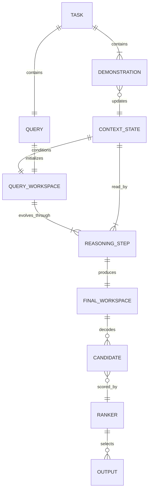
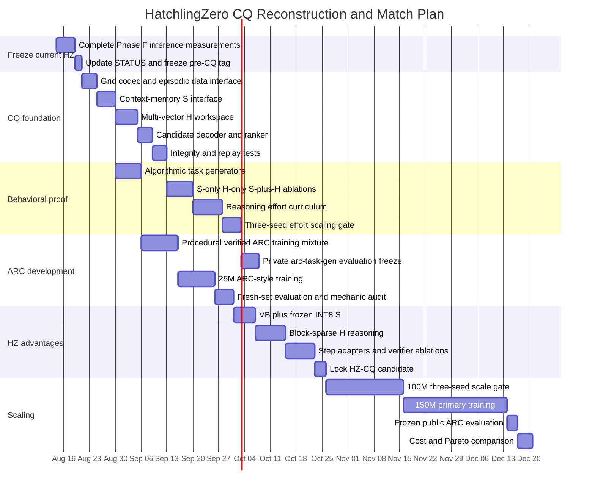

# HatchlingZero × BDH-CQ: Audit, Reconstruction, and Path to Match or Beat Pathway

## Executive summary

The most important conclusion from the research is that **you are substantially closer to a credible BDH-CQ reconstruction than a fresh project would be**, because HatchlingZero has already solved several pieces that Pathway's public BDH-CQ interface appears to need: a byte-faithful BDH oracle, exact streaming synaptic state, a compressed state implementation, a successful recurrent-depth training curriculum, instrumentation, and now a viable trained-in-path block-sparsity recipe. fileciteturn9file0 fileciteturn10file0 fileciteturn13file0

Pathway's public information is **not sufficient to reproduce BDH-CQ exactly**. The paper deliberately publishes the system-level interface

\[
S_t=U_\theta(S_{t-1},D_t),
\]

\[
H_0=E_\theta(x^\*,S_K),
\]

\[
H_{r+1}=F_\theta(H_r,S_K),
\]

\[
\hat y=G_\theta(H_R),
\]

but states that the dimensions, exact update equations, implementation details, and complete training recipe remain proprietary. The evaluated system also includes input transformations, candidate construction, candidate ranking, and an inference pipeline that are not released. citeturn15view2turn16view0turn16view1

So the right objective is **not to pretend to clone their closed implementation**. The objective should be:

> **Build the simplest BDH-native implementation that satisfies every public BDH-CQ architectural constraint, then use controlled ablations to independently discover the missing implementation choices.**

That gives HatchlingZero a clean route to the same behavioral target.

Pathway's target to match is concrete: its 150M-parameter system scores **29.5% pass@2 on the 400-task public ARC-AGI-1 evaluation set**, with 97/400 pass@1 and 118/400 pass@2, and reports about **0.85 H200 GPU-seconds per task**, corresponding to a computed $0.00070/task at their assumed $3/H200-hour. The black-box evaluation reproduced the 29.5% result. citeturn14academia36turn15view2turn16view1

Even more importantly, Pathway exposed the property you need to reproduce before worrying about the leaderboard: the model is trained at varying latent reasoning efforts, and its pass@2 changes from **21% at LOW → 27% at MEDIUM → 29.5% at HIGH**, while LOW and MEDIUM reduce inference cost by 22% and 11% respectively. The paper does **not** disclose the actual iteration counts corresponding to those effort levels. citeturn21view2turn21view4turn16view2

That means your first real BDH-CQ success criterion should not be “solve ARC.” It should be:

\[
\boxed{
\text{hard-task accuracy}(R_\text{high})
>
\text{{hard-task accuracy}}(R_\text{medium})
>
\text{hard-task accuracy}(R_\text{low})
}
\]

after the system has been **trained in-path at those reasoning efforts**.

That is exactly where your previous Phase 5 failed: normal BDH recurrence did not acquire useful extra computation merely because inference depth increased. BDH-CQ changes the architecture by giving contextual memory \(S\) and ongoing reasoning \(H\) different roles, then explicitly exposing the system to varying latent effort during training. citeturn15view2turn21view2

Your current repository also has two major developments that materially improve the plan compared with our previous conversation:

1. **HZ-Core-2 is now locked.** It is faithful BDH + the `2→4→6→8` curriculum + D/4 Value Bottleneck + BF16 speed-state mode / base+delta INT8 memory-state mode. fileciteturn12file0
2. **BlockBDH's original training-instability problem is no longer simply “unresolved.”** Soft-to-sparse training with diversity pressure and a `100%→75%→60%→50%` active-block curriculum produced **1.00 reassignment accuracy on all five seeds** at final hard 50%-active execution. The remaining problem is scale and speed+quality validation on the same larger trained model. fileciteturn13file0

My recommendation is therefore to **finish the currently pending Phase F inference measurements, freeze that result, and then start an HZ-CQ branch immediately rather than continuing to invent more language-model state compression mechanisms.**

The architecture I would aim for is:

```text
 demonstrations
      │
      ▼
┌──────────────────┐
│ BDH ingestion    │
│ recurrent state  │
└────────┬─────────┘
         │
      S0 → S1 → ... → SK
                      │
                      │ read-only during reasoning
                      ▼
query ───────► H0 ─► H1 ─► H2 ─► ... ─► HR
                       recurrent BDH-like
                       latent workspace
                              │
                              ▼
                    candidate decoder
                              │
                         2 candidates
                              │
                              ▼
                           ranker
```

The strongest HatchlingZero-specific route to **beat**, rather than merely match, BDH-CQ is likely:

\[
\boxed{
\text{compressed/quantized persistent }S
+
\text{full-precision }H
+
\text{depth/effort curriculum}
+
\text{eventual block-sparse }H
}
\]

because CQ creates an especially favorable situation for your INT8 work: once demonstrations have been incorporated, \(S_K\) is conceptually read-only during the reasoning loop. Instead of repeatedly requantizing a changing state—the source of your current INT8 slowdown—you can potentially **quantize \(S_K\) once after ingestion and repeatedly read it during \(H\)-reasoning**. That is an architectural opportunity created by the S/H separation, and it directly attacks a measured HatchlingZero weakness. Pathway explicitly distinguishes changing contextual memory \(S_t\) from the query's ongoing workspace \(H_r\). citeturn16view0turn16view1

## What is actually known about BDH and BDH-CQ

### The public BDH foundation

The original BDH paper describes Dragon Hatchling as a sequence architecture with sparse positive activations, an associative/synaptic working-memory interpretation, and Transformer-like language/translation scaling from 10M to 1B parameters. Those broad scaling claims come from the authors; HatchlingZero should continue treating them as upstream evidence rather than assuming they transfer automatically to your implementation. citeturn15view0

The official public repository is considerably more useful than the abstract because `bdh.py` exposes the actual GPU formulation. A default public model uses six recurrent levels, `n_embd=256`, four heads, byte-level vocabulary size 256, and a large latent neuron dimension

\[
N=
\frac{\texttt{mlp\_internal\_dim\_multiplier}\cdot D}
{n_h}.
\]

Its encoder, value encoder and decoder are **single parameter tensors reused through every recurrent level**, rather than separate parameters for each level. citeturn18view0

One public iteration is essentially:

\[
x_s=\operatorname{ReLU}(xE)
\]

\[
Q=K=x_s
\]

\[
y_{KV}=\operatorname{tril}(QK^\top,-1)V
\]

\[
y_s=
\operatorname{ReLU}\left(
\operatorname{LN}(y_{KV})E_v
\right)
\]

\[
z=x_s\odot y_s
\]

\[
x'=
\operatorname{LN}
\left(
x+
\operatorname{LN}(zD_{\mathrm{dec}})
\right).
\]

The same `encoder`, `encoder_v` and `decoder` are reused by the public code's `for level in range(C.n_layer)` loop. ReLU produces positive/sparse neuronal activations, and the multiplication \(x_s\odot y_s\) provides the second multiplicative gating operation. citeturn18view0

The official training demonstration is similarly simple: byte-level Tiny Shakespeare, blocks of 512, batch 32, AdamW with learning rate \(10^{-3}\) and weight decay 0.1, using correctly shifted next-byte targets. The repository currently compiles the model with `torch.compile`. citeturn19view0

Pathway explicitly warns that the public repository is the **baseline paper implementation**, not the internal implementation behind its 97.4% Extreme Sudoku result. That matters because it demonstrates a precedent: Pathway's strongest reasoning systems already contain internal machinery beyond what appears in `pathwaycom/bdh`. citeturn17view1

### What CQ adds

BDH-CQ makes the separation between **memory and computation** explicit.

Demonstrations update contextual memory:

\[
S_t=U_\theta(S_{t-1},D_t).
\]

After demonstration ingestion, the query creates a structured workspace:

\[
H_0=E_\theta(x^\*,S_K).
\]

That workspace is repeatedly transformed while conditioned on the contextual state:

\[
H_{r+1}=F_\theta(H_r,S_K).
\]

Only after the latent loop does the system decode:

\[
\hat y=G_\theta(H_R).
\]

Pathway explicitly says \(S_t\) changes as evidence is encountered and supports in-context learning, whereas \(H_r\) holds the ongoing computation needed to answer the current query. citeturn16view0turn16view1

This distinction is the architectural clue I would take most seriously.

It also fits your own experiments unusually well:

```text
Compress dimensions INSIDE a state
Value Bottleneck                         ✅

Force semantically different states
to collapse/share                         ❌

Give different computational roles
different state objects                   ← BDH-CQ
```

That does not prove why grouped state failed, but it is consistent with the empirical pattern in HatchlingZero.

Pathway further says the workspace is **structured and continuous**, not a sequence of verbalized chain-of-thought tokens. The complete system includes transformations of inputs, construction of candidate outputs, candidate ranking and the inference pipeline. citeturn15view2

That last point is important. A faithful reconstruction should **not** evaluate only a raw neural decoder and compare it directly to Pathway's full pass@2 system.

### Training and data

The disclosed training objective is episodic: the model predicts target outputs **after preceding examples have already been incorporated into its recurrent context**. The complete training recipe is proprietary. citeturn16view1

The 150M model is trained on a mixture containing private curated examples plus:

- ARC-AGI-1 **training** tasks;
- RE-ARC;
- ConceptARC;
- ARC-Heavy;
- ARC-GEN100K;
- additional undisclosed augmentations. citeturn16view1

Pathway additionally trains the system while changing latent reasoning effort, thereby producing one model that can later be run at LOW, MEDIUM or HIGH effort. Extra effort improves pass@2 in the reported system. The actual \(R\) values and sampling schedule are not disclosed. citeturn21view2turn16view2

### Evaluation and fresh-task generation

The headline evaluation is the 400-task public ARC-AGI-1 evaluation split under the two-attempt convention. Pathway reports 24.25% pass@1 and 29.50% pass@2, with a descriptive 95% Wilson interval of approximately 25.24–34.15% for pass@2. citeturn15view2

They also released `arc-task-gen`, which generates fresh ARC-style tasks designed to resemble the public evaluation distribution. The repository says the reason is precisely that a public benchmark cannot fully distinguish few-shot induction from prior familiarity. citeturn17view2

Its simple generator currently defaults to GPT-5.6, uses `text-embedding-3-small` for semantic filtering, filters generated-task descriptions above cosine similarity 0.80, and filters similarity to public-evaluation descriptions at 0.92. The latter threshold was selected just above the maximum similarity the authors observed between distinct public evaluation tasks. citeturn12view0turn12view1turn12view2

The stratified generator goes further: it conditions generation on an anchor profile containing dimensions, colors, an LLM-assigned cognitive category and optionally a transformation mechanic, without placing the public task's actual grids, task ID or rule description into the generation prompt. Its categories include object-centric, geometric, spatial-relational, numerical, pattern completion and compositional reasoning. citeturn12view3turn12view4

This is useful but should not become your sole ground truth. Pathway's own appendix says its generated cohorts contain some quality limitations: manual review found at least one task whose stated output contradicted the demonstrations' rule; independent mechanic labels agreed with requested labels on 82.9% of a labeled subset; and deduplication removed 24% of a merged generated pool. citeturn16view3

For training, I would therefore combine LLM-generated diversity with **executable procedural tasks**. Google's ARC-GEN repository is particularly useful because it exposes procedural generators and reports that its validation command reproduces all 400 ARC-AGI-1 generator targets with 400 passing and zero failing. citeturn20search0turn20search2

### The Pathway performance target

Pathway's reported effort/cost curve is:

| Reasoning effort | Public ARC pass@2 | Relative cost |
|---|---:|---:|
| LOW | 21.0% | −22% |
| MEDIUM | 27.0% | −11% |
| HIGH | **29.5%** | baseline |

citeturn16view2turn21view4

The paper also profiles fresh generated cohorts:

| Cohort | Tasks | Solved | Exact whole-task rate |
|---|---:|---:|---:|
| Public ARC-AGI-1 | 400 | 118 | 29.5% |
| Calibrated generated | 400 | 149 | 37.2% |
| Mechanic-stratified generated | 1,131 | 337 | 29.8% |

These generated cohorts serve different experimental purposes and are **not directly interchangeable leaderboards**. citeturn16view3

Finally, Pathway says early pretraining experiments span 1B–600B parameters with Transformer-like scaling and discusses training at 1T scale. This is presently a **Pathway claim rather than a result documented with the sort of scaling curves, token budgets and checkpoints needed for independent verification**, so I would not use it as a HatchlingZero design assumption. citeturn21view2turn17view2

## HatchlingZero repository audit

### The strongest current results

Your repo has advanced beyond several descriptions in the earlier plan.

The trusted starting point is excellent: the README documents a byte-faithful PyTorch BDH oracle, a byte-faithful training port and an integrity contract intended to prevent exactly the kinds of silent implementation errors you already found in the earlier hand-port. fileciteturn9file0

The strongest general training result is now fully confirmed:

\[
2\rightarrow4\rightarrow6\rightarrow8
\]

recurrent iterations over four equal quarters of the token budget.

Across seeds 7, 8 and 9, the curriculum improves validation loss by roughly 3–5% relative to the fixed-depth baselines available while producing an essentially seed-invariant **1.59× training-time improvement** and no transition instability. A small schedule study also found the equal-quarter schedule better than keeping more time at full depth or skipping the depth-six stage. fileciteturn10file0

`torch.compile` adds another large systems win. In the production combined run, curriculum+compile took **1,558 seconds** versus **4,064 seconds** for fixed-depth eager training, a measured **2.609× overall speedup**; validation loss was 1.5723 and reported peak memory fell from roughly 7.93 GB to 4.97 GB. fileciteturn10file0

Value Bottleneck also looks materially better now than the old fixed-depth experiment suggested. Under curriculum training, D/4 reached 1.6309 versus exact BDH+curriculum at 1.5820; D/2 and D/3 did not recover quality and actually came out slightly worse while using more state. A six-seed cheaper check also favored D/4 on the majority of seeds. fileciteturn11file0

HZ-Core-2 is therefore coherently defined as:

```text
faithful BDH
+
2 → 4 → 6 → 8 curriculum
+
D/4 Value Bottleneck
+
BF16/FP16 state for speed mode
or
base+delta INT8 state for memory mode
```

with 25,559,040 parameters in the canonical 25M-scale configuration. fileciteturn12file0

### The current Transformer comparison is scientifically interesting

The most recent matched 25M-scale comparison reverses the old pilot on **quality**, but not on compute.

On the same RTX 3060, token budget, byte vocabulary and approximately matched parameter count:

| Model | Best validation loss | Training time | Throughput | Peak VRAM |
|---|---:|---:|---:|---:|
| Exact BDH + curriculum | **1.5820** | 2,559.5 s | 9,768.9 tok/s | ~7.92 GiB |
| HZ-Core-2 | 1.6309 | 2,535.5 s | 9,861.1 tok/s | ~7.31 GiB |
| Matched Transformer + RoPE | 1.7395 | **478.85 s** | **52,214 tok/s** | **0.69 GiB** |

So at this experiment's fixed token budget, the BDH family is materially better on held-out text CE, while the Transformer trains about 5.3× faster and uses roughly 10–11× less peak VRAM. This remains a **partial Phase F result**: code/math/reasoning evaluations, matched memory tests, inference timing and energy measurements are still incomplete. fileciteturn14file0

That is exactly why CQ is strategically attractive: it gives you a way to test whether the extra recurrent computation buys **capability that cheap Transformer computation cannot reproduce at the same parameter scale**, rather than continuing to optimize language CE alone.

### The memory result is nuanced

At the current matched scale, exact BDH state is 256 MB per batch item and crosses below the matched Transformer's KV memory only around **21.8K context tokens**. HZ-Core-2's VB state lowers this to 64 MB in speed mode and roughly a 5.46K-token crossover; the base+delta INT8 mode is around 80 MB and crosses around 6.83K tokens. fileciteturn14file0

That is an important correction to any simplistic “O(1) always beats KV” claim.

It also suggests a CQ-specific advantage: ARC demonstrations are tiny compared with 5K-token language contexts, so **state capacity/compute rather than long-context asymptotics is the immediate CQ concern**. CQ's persistent state becomes more strategically important later when you move the same architecture to agents, language or changing long-running environments.

### INT8 is usable, but the CQ formulation may fix its worst systems problem

Your full-INT8 recurrent state has tiny quality drift, but repeatedly quantizing a state that changes every chunk costs throughput. Base+delta reduces the drift and improves on full-INT8, yet at K=64 is still approximately 21.4% slower than plain BF16 state. fileciteturn12file0

BDH-CQ potentially changes this operating regime:

```text
demo ingestion:
S changes
S changes
S changes

then:
freeze S

reasoning:
H reads S
H reads S
H reads S
H reads S
```

If your CQ implementation follows the public \(F_\theta(H_r,S_K)\) interface, the long-term contextual state need not be requantized at all during reasoning. That creates a direct experiment:

\[
\boxed{
\text{ingest demos in BF16}
\rightarrow
\text{quantize }S_K\text{ once}
\rightarrow
\text{reason repeatedly from INT8 }S_K
}
\]

This is an inference I am making from Pathway's published S/H interface plus your measured INT8 bottleneck; it is not a disclosed Pathway technique. citeturn16view0turn16view1

### BlockBDH should be upgraded from “unstable” to “promising, tiny-scale validated”

This is the biggest status item your plan documents need updated on.

The latest BlockBDH result uses a continuous learned gate with diversity pressure, followed by a gradual sparsity curriculum:

\[
100\%\rightarrow75\%\rightarrow60\%\rightarrow50\%.
\]

At final real hard block selection, all five tested seeds achieve **1.00 reassignment accuracy**, including the seeds that failed previous routing approaches. Pushing the trained model below the sparsity range it saw during training causes accuracy to crash, which is exactly the signature expected of a genuinely trained-in-path mechanism rather than an evaluation leak. fileciteturn13file0

This does **not** yet justify putting BlockBDH into HZ-Core-2, because the result is tiny-scale and speed has not been re-measured on that exact gated+annealed model. But it absolutely justifies testing BlockBDH again **inside the CQ reasoning loop**, where recurrent \(H\) updates may make skipped computation particularly valuable. fileciteturn13file0

### Documentation debt worth fixing before CQ

The repo is unusually good at preserving negative results, but the rapid progress has created some status drift. The Next Phase Plan still describes BlockBDH as having unresolved instability, while the newer I4.2 document records a five-seed resolution at tiny scale. The README's high-level “where the project stands” prose also retains older small-pilot framing even though the newer Phase F comparison now gives a materially different 25M-scale quality result. fileciteturn15file0 fileciteturn13file0 fileciteturn14file0

Before opening the CQ lane, I would add one canonical:

```text
docs/STATUS.md
```

containing:

```text
mechanism
latest evidence
scale
seeds
quality result
speed result
memory result
status
canonical source document
```

and make README/plans point to it.

That prevents another future agent from resurrecting something that is dead—or overlooking something that has since been fixed.

## Architecture comparison and the closest reproducible CQ reconstruction

### Comparison matrix

| Component | BDH-public | BDH-CQ (Pathway) | HatchlingZero current |
|---|---|---|---|
| Core computation | Shared recurrent BDH weights; ReLU-low-rank projections + causal linear-style attention. citeturn18view0 | Built from BDH family; exact internal CQ layer design undisclosed. citeturn15view2 | Byte-faithful BDH oracle plus explicit derivatives. fileciteturn9file0 |
| Weight tying | Same encoder/value-encoder/decoder reused through levels. citeturn18view0 | Recurrent computation over model depth; exact organization proprietary. citeturn15view2 | Same trusted tying; curriculum directly exploits it. fileciteturn10file0 |
| Positive sparse activity | ReLU activations plus multiplicative sparse gate. citeturn18view0 | Described as high-dimensional positive activations / low-rank communication. citeturn15view2 | Preserved in exact BDH and VB derivatives. fileciteturn9file0 |
| Persistent context memory | Original paper describes synaptic working memory; public `bdh.py` computes the dense causal form. citeturn15view0turn18view0 | Explicit recurrent contextual state \(S_t\) updated by demonstrations. citeturn16view0 | Exact streaming state implemented and tested; VB compresses its value width. fileciteturn9file0 |
| Reasoning workspace | No separate CQ workspace in public repo. citeturn17view1 | Explicit structured continuous \(H_r\), separate conceptual role from \(S_t\). citeturn16view0turn16view1 | **Missing; this is the key new component to build.** |
| Task adaptation | Sequence context / associative state. citeturn15view0 | Demonstrations alter \(S\) at inference with fixed parameters. citeturn15view2 | Streaming state works; episodic demonstration-conditioned training not yet canonical. |
| Latent test-time compute | Normal recurrent depth exists, but no public CQ effort controller. citeturn18view0 | LOW/MEDIUM/HIGH effort gives 21/27/29.5% pass@2. citeturn16view2 | Old ordinary-depth extrapolation failed; curriculum training succeeds. fileciteturn15file0 |
| Training objective | Next-byte LM in public demonstration. citeturn19view0 | Episodic exact-grid prediction after demonstrations enter context; complete recipe closed. citeturn16view1 | Strong LM curriculum recipe; needs episodic CQ trainer. fileciteturn10file0 |
| State compression | None exposed publicly. | Not disclosed. | D/4 VB selected; INT8/base+delta implemented. fileciteturn11file0turn12file0 |
| Block sparse compute | Not in public baseline. | Not disclosed. | 50%-active soft→hard routing now 5/5 stable at tiny scale. fileciteturn13file0 |
| Candidate generation | Token generation only in baseline. citeturn18view0 | Up to two ranked candidates; construction/ranker proprietary. citeturn15view2 | Needs CQ-specific candidate decoder/ranker. |
| Public ARC result | None. | **29.5% pass@2, 150M params.** citeturn15view2 | None yet. |
| Openness | Code + paper public. citeturn17view1 | Interface/paper public; exact CQ implementation closed. citeturn16view1 | Highly instrumented public research repo. |
| Fresh ARC tooling | N/A | `arc-task-gen` released for private fresh evaluation. citeturn17view2 | Should vendor/pin it and build a stricter verification layer. |

### Proposed S/H entity model

The following is **the HatchlingZero reconstruction**, not an assertion about Pathway's proprietary internals.



The critical invariant should be:

\[
\frac{\partial S}{\partial r}=0
\]

during the inference reasoning loop—not in the gradient sense, but in the **state-update sense**. During training you normally still want gradients to flow from the answer through reads of \(S_K\) back into the demonstration-ingestion machinery. Do **not** casually call `.detach()` on \(S_K\) merely because it is read-only.

### Minimal HZ-CQ architecture

I would build `HZCQ` on **exact BDH first**, not HZ-Core-2.

Use the current exact streaming state as \(S\), preserving the separate state bank associated with each recurrent BDH level. Your grouped-state experiments are strong evidence against merging those banks just to save memory.

Represent the workspace as a **multi-vector grid state** rather than one task vector:

\[
H_r\in\mathbb{R}^{B\times M\times D}
\]

where \(M\) contains:

```text
query grid-cell vectors
+
a small number of global workspace slots
+
optional output-construction slots
```

Grid cells should receive:

\[
e_{cell}=
e_{color}
+
e_{row}
+
e_{column}
+
e_{role}.
\]

This directly preserves ARC's spatial structure instead of serializing the entire problem into language.

For each reasoning cycle, walk through the same BDH recurrent levels and read the corresponding contextual bank:

\[
H^{l+1}
=
\Phi_\theta
\left(
H^l,
\operatorname{Read}(H^l,S_l)
\right).
\]

Then repeat the whole tied cycle \(R\) times.

The first implementation should favor simplicity over cleverness.

### Minimal prototype pseudocode

```python
class HZCQ(nn.Module):
    def __init__(self, cfg):
        super().__init__()
        self.context_core = BDHContextCore(cfg)
        self.workspace_init = GridWorkspaceEncoder(cfg)
        self.reasoner = TiedWorkspaceReasoner(cfg)
        self.decoder = GridDecoder(cfg)
        self.ranker = CandidateRanker(cfg)

    def forward(
        self,
        demonstrations,
        query,
        reasoning_steps: int,
        targets=None,
    ):
        # One state bank per BDH recurrent level.
        S = self.context_core.init_state(
            batch_size=query.batch_size,
            device=query.device,
        )

        # Context-memory phase.
        for demo_input, demo_output in demonstrations:
            demo_tokens = encode_demo_pair(demo_input, demo_output)
            _, S = self.context_core(
                demo_tokens,
                S,
                write_state=True,
            )

        # S is read-only from this point forward.
        # During training, do NOT detach it by default:
        # gradients should still reach demonstration ingestion.
        S_frozen = S

        # Query -> structured multi-vector reasoning workspace.
        H = self.workspace_init(query, S_frozen)

        # Latent-reasoning phase.
        for _ in range(reasoning_steps):
            H = self.reasoner(
                workspace=H,
                context_state=S_frozen,
            )

        # Produce two independently useful candidates.
        candidates = self.decoder(H, num_candidates=2)

        # Score rather than blindly returning generation order.
        scores = self.ranker(
            candidates=candidates,
            workspace=H,
            context_state=S_frozen,
        )

        loss = None
        if targets is not None:
            loss = compute_cq_loss(
                candidates,
                scores,
                targets,
            )

        return candidates, scores, loss
```

### Decoder design

Do not begin with an expensive autoregressive pixel-by-pixel decoder unless testing it as a control.

ARC outputs naturally permit a more efficient factorization:

\[
p(h,w\mid H_R)
\]

followed by

\[
p(y_{ij}\mid H_R,h,w).
\]

So predict:

```text
output height
output width
+
all grid cells in parallel
```

and have two candidate heads or a controlled second candidate constructed from the next-most-probable structural interpretation.

Pathway explicitly has separate candidate construction and ranking; this gives you the same public system capability without assuming its hidden implementation. citeturn15view2

### HZ-CQ-150M tokenizer lock

For the first HZ-CQ 150M reproduction, lock the tokenizer to the existing
byte-level interface:

```text
vocab_size = 256
tokenizer   = raw bytes
embedding   = unchanged from the BDH-compatible baseline
```

Do not increase the vocabulary during the reproduction or the initial ARC
curriculum. ARC inputs are naturally expressible as a small set of structured
symbols, and keeping the byte vocabulary preserves compatibility with the
public BDH formulation and avoids making tokenizer efficiency a confound in
the reasoning experiment. Spend the parameter budget on the contextual state
bank, structured workspace, and tied latent reasoning cycles instead.

This is a CQ-specific lock, not a permanent HZ language-model tokenizer
decision. After the 150M reasoning baseline is stable, run a controlled
constant-parameter sweep over `V=256, 4K, 8K, 16K, 32K`. Record ARC quality,
quality per parameter, quality per training FLOP, quality per joule, bytes per
recurrent step, and reasoning quality per recurrent step. If the general
language HZ line later needs shorter sequences, evaluate an 8K-16K
byte-fallback tokenizer separately rather than changing the CQ reproduction.

## Experimental program from toy proof to 150M match

Do this as a **funnel**. Do not scale a model merely because its training loss decreases.

### Immediate checkpoint before CQ work

Finish the already-dispatched Phase F inference run first.

Required outputs:

```text
prefill throughput
decode throughput
latency/token
peak inference VRAM
state/KV bytes
joules/generated token
```

for:

```text
Exact BDH
HZ-Core-2 speed mode
HZ-Core-2 memory mode
matched Transformer
```

Phase F already has the validated state/KV crossover calculation and the training-side comparison; the missing real GPU inference/energy axes are explicitly documented. fileciteturn14file0

Then freeze:

```text
tag: pre-cq-hz-core2
```

and update `docs/STATUS.md`.

That gives CQ development a clean ancestor.

### Experiment program

| Stage | Model / experiment | Data | Seeds | Metrics | Required artifacts | Promotion gate |
|---|---|---|---:|---|---|---|
| CQ plumbing | 2–5M exact BDH + S/H | deterministic binding, overwrite, copy | 7,8,9 | exact accuracy, S mutation, H norm, replay | model + unit tests + 3 checkpoints | 100% easy-task learning; S bitwise/read-only during H |
| S/H necessity | S-only vs H-only vs S+H | bindings, graph reachability, reassignment, relational tasks | 7,8,9 | exact acc by difficulty | ablation report | S+H beats both controls on ≥3 task families |
| Latent-effort proof | R∈{1,2,4,8} | complexity-held-out algorithmic suite | 7,8,9 | accuracy vs R, cost vs R | effort curves | hard accuracy rises ≥5 pp from LOW→HIGH in all 3 seeds |
| ARC mini | 10–25M | verified procedural ARC-style train + held-out mechanics | 7,8,9 | pass@1/2, shape, pair, cell | frozen dataset hashes + ckpts | ≥15% relative gain over same-param no-H BDH |
| Fresh ARC | 25M | private `arc-task-gen` calibrated + mechanic set | 7,8,9 | whole-task, mechanic CIs, R curves | sealed private eval manifest | positive effort scaling + no severe mechanic collapse |
| HZ efficiency | best 25M CQ + VB/INT8 | same frozen private eval | 7,8,9 | accuracy, state MB, GPU-sec/task | efficiency report | ≤1 pp loss for meaningful state reduction |
| Sparse H | best 25M + BlockBDH reasoning | same frozen eval | 0–4 | 5-seed stability, GPU-sec/task | routing logs + hard sparse ckpts | ≥5/5 stable; ≥1.5× real reasoning speedup |
| Scale pilot | 100M | ARC mixture + verified synthetic corpus | 7,8,9 | all metrics | scaling report | private pass@2 materially >25M and effort curve strengthens |
| Pathway match | 150M | locked training mixture | 7,8,9 | ARC public pass@1/2 + compute | release candidate | ≥29.5% pass@2 on pre-registered primary |
| Beat attempt | 150M HZ variants | same | 7,8,9 | score-cost Pareto | final report | >29.5% at ≤0.85 H200-sec/task, or same score ≥25% cheaper |

The first “latent-effort proof” gate is deliberately strict because this is the **defining CQ hypothesis**, and Pathway itself reports precisely that monotonic effort behavior. citeturn21view2turn16view2

### Synthetic task ladder

Do not make the first task suite ARC-sized.

Use tasks with **known computational depth**:

| Family | What \(S\) must learn | What \(H\) must compute |
|---|---|---|
| Arbitrary color binding | demo-defined symbol mapping | apply mapping |
| Reassignment | latest binding overrides old | retrieve correct current rule |
| Graph reachability | graph/evidence from demos | multi-hop closure |
| Ordering | relation semantics | sort 3→10 objects |
| Nested containment | relation rules | increase nesting depth |
| Copy/translation | operator learned from examples | execute at variable distance/count |
| Rotation/reflection | transformation binding | execute spatial operator |
| Composition | two learned operations | execute A→B |
| Conditional transform | context determines branch | infer branch then execute |
| Small Sudoku / Latin constraint | persistent constraints | iterative constraint refinement |

This mirrors several types of controlled analysis Pathway itself used—binding, ordering, nesting, copy-like behavior and composition—while giving you executable ground truth and arbitrary difficulty. citeturn15view2turn21view2

Each generator must expose a difficulty variable such as:

```text
path length
number of objects
nesting depth
number of composed operators
number of simultaneous bindings
number of constraints
```

Train below one complexity ceiling and test above it.

Then plot:

\[
A(R,d)
\]

where \(R\) is reasoning effort and \(d\) is task difficulty.

The ideal CQ signature is:

```text
easy:
R=2  ≈ R=4 ≈ R=8

medium:
R=4 > R=2

hard:
R=8 > R=4 > R=2
```

That is far stronger evidence of learned test-time computation than a single final accuracy.

### Reasoning curriculum

Do not train the first model at \(R=16\) from initialization.

Your own successful depth curriculum and Pathway's training across reasoning effort both point toward **training recurrence in-path**. fileciteturn10file0 citeturn21view2

Start with:

```text
first quarter:
maximum R = 2

second quarter:
maximum R = 4

third quarter:
maximum R = 6

final quarter:
maximum R = 8
```

Within each stage, sample lower depths too, for example:

```text
max 2: {1,2}
max 4: {2,4}
max 6: {2,4,6}
max 8: {2,4,6,8}
```

Do not immediately use intermediate-loss supervision. First find out whether final-answer training alone creates an effort curve.

If LOW inference later performs poorly, add an auxiliary loss at intermediate checkpoints:

\[
L=
L_{R_{\max}}
+
\lambda
\sum_{r\in\mathcal{R}_{aux}}L_r.
\]

That should be an ablation, not part of the initial reconstruction.

### ARC training and private evaluation

Use three separate pools.

**Training pool**

```text
ARC-AGI-1 training split
RE-ARC
ConceptARC
ARC-Heavy
ARC-GEN100K
your executable synthetic families
```

This mirrors the public portion of Pathway's disclosed mixture while replacing their unavailable private curated examples with your own verified generators. citeturn16view1

**Development validation**

Use held-out seeds and held-out parameter ranges from executable procedural generators, including ARC-GEN/RE-ARC-style tasks. Google's ARC-GEN's explicit generators make this particularly useful for generating arbitrarily many validated examples. citeturn20search0turn20search7

**Private final validation**

Generate once using `arc-task-gen`:

```text
400 calibrated tasks
+
~1,000 mechanic-stratified tasks
```

Then hide:

```text
descriptions
human-readable names
generation prompts
anchor metadata
random seed
```

from model development.

Only expose aggregate reports.

Do not regenerate a new “private” evaluation every time a model fails; that simply turns it into a development set.

### Verification pipeline

Because Pathway itself documents imperfections in LLM-generated ARC tasks, add a stricter acceptance pipeline. citeturn16view3

```text
candidate task
      │
      ▼
JSON/shape/color validation
      │
      ▼
demonstration consistency check
      │
      ▼
executable verifier where available
      │
      ▼
semantic novelty filter
      │
      ▼
cross-generator duplicate filter
      │
      ▼
LLM independent rule audit
      │
      ▼
human audit sample
      │
      ▼
PRIVATE FROZEN EVAL
```

For your own generated training tasks, require an executable transformation whenever possible:

\[
f(x_i)=y_i
\]

for every demonstration and test pair.

That prevents the student from learning from internally contradictory examples.

### Exact metrics to collect

Every CQ run should emit one JSON report containing:

**Capability**

\[
\text{whole-task pass@1}
\]

\[
\text{whole-task pass@2}
\]

\[
\text{test-pair exact accuracy}
\]

\[
\text{output-shape accuracy}
\]

\[
\text{cell accuracy}\mid\text{correct shape}
\]

\[
\text{task consistency}
=
P(\text{all test inputs solved})
\]

plus Wilson 95% confidence intervals and per-mechanic results.

**Reasoning scaling**

\[
A(R=1),A(2),A(4),A(8)
\]

\[
\Delta A/\Delta\log_2R
\]

and effort curves separately by difficulty.

**Mechanism**

```text
||S_t||
||S_t - S_{t-1}||
||H_r||
||H_r - H_{r-1}||
cos(H_r, H_{r+1})
activation sparsity
block utilization
router entropy
per-depth S read norm
```

**Systems**

```text
ingestion GPU-ms
reasoning GPU-ms
candidate decode GPU-ms
ranking GPU-ms
total GPU-sec/task
peak VRAM
S bytes
H bytes
joules/task
tasks/sec
```

Keep these phases separately timed. Otherwise you will not know whether a speed improvement came from latent reasoning or merely a cheaper decoder—the same kind of timing attribution problem you already found in Phase 1.

**Reproducibility**

```text
git SHA
checkpoint SHA256
dataset manifest hash
private-eval manifest hash
seed
dtype
device
driver/CUDA/PyTorch versions
config
training tokens/tasks
wall-clock
peak VRAM
```

## Variants with a credible path to beating Pathway

Do not run all of these simultaneously. First reproduce S/H behavior. Then introduce **one axis at a time**.

### Freeze-once quantized contextual memory

This is my highest-priority HZ-specific innovation.

Current HZ INT8 is slow because a dynamically changing state repeatedly crosses:

```text
INT8 → BF16
update
BF16 → INT8
```

But CQ naturally has:

```text
changing S
during demos

then

fixed S_K
during reasoning
```

So test:

```text
demos
  ↓
BF16 S_K
  ↓
ONE quantization
  ↓
INT8 S_K
  ↓
H1 reads it
H2 reads it
H3 reads it
...
HR reads it
```

Compare:

| State | Writes during reasoning | Expected use |
|---|---:|---|
| BF16 S | none | quality/speed control |
| INT8 S frozen once | none | primary memory variant |
| Base+delta S | only during demos | long-demo / streaming variant |

This may turn INT8 from a throughput penalty into a much more favorable CQ deployment mode.

Gate:

\[
\Delta\text{pass@2}\le1\text{ pp}
\]

with

\[
\text{state RAM reduction}\ge3.5\times
\]

and no >5% total task-time regression.

### Value Bottleneck for S, not H

Keep the semantic roles separate.

Use:

\[
S:\quad d_s=D/4
\]

but initially:

\[
H:\quad D.
\]

Your evidence says the contextual associative state tolerates substantial dimensional compression, while grouped-role compression has repeatedly been dangerous. fileciteturn11file0

Only after CQ works should you sweep:

```text
H width:
D
3D/4
D/2
```

There is no reason memory and cognition need the same precision or width.

A very plausible final model is:

```text
S:
compressed + INT8

H:
wide + BF16
```

That is a much more biologically and computationally sensible allocation than compressing every state equally.

### Block-sparse reasoning workspace

Your new BlockBDH result is almost tailor-made for the repeated \(H\) loop.

Use full/dense computation while the model learns what its workspace neurons mean:

```text
100% active
↓
75%
↓
60%
↓
50%
```

with the diversity-anchored learned gate that already stabilized the tiny reassignment experiment. fileciteturn13file0

But apply sparsity **only to \(F(H,S)\) first**, not context ingestion.

Why?

Because if:

\[
\text{reasoning cost}\propto R
\]

then the savings compound with the very mechanism that gives CQ more intelligence.

If a 50%-active reasoner preserves the effort curve and recovers your earlier approximately 2× block-compute speed regime, then HIGH effort might approach MEDIUM's dense cost.

That is precisely how you move the Pareto frontier rather than merely reproduce it.

### Tiny per-reasoning-step adapters

BDH's tied weights are parameter-efficient but may make every reasoning iteration behave too similarly.

Do **not** introduce independent full layers.

Instead:

\[
h_{r+1}
=
F_\theta(h_r,S;\gamma_r,\beta_r)
\]

where each reasoning stage gets tiny FiLM-style scales/biases, or:

\[
W_r=W+A_rB_r
\]

with rank 2–8 adapters.

Use adapters by **effort bucket**, not necessarily every individual iteration:

```text
early reasoning adapter
middle reasoning adapter
late reasoning adapter
```

This preserves almost all weight sharing while permitting distinct computational phases such as:

```text
infer rule
→ construct candidate
→ verify/refine
```

Promotion gate:

\[
\frac{\Delta\text{pass@2}}
{\Delta\text{parameters}}
\]

must be clearly favorable; I would reject >5% parameter growth unless the quality increase is substantial.

### Bidirectional workspace, causal memory

The public BDH code is causal because it is a sequence model. ARC latent reasoning does not inherently need causality inside \(H\).

So preserve causal ingestion for \(S\), but test:

```text
S: causal
H: bidirectional / all-to-all structured interaction
```

against:

```text
S: causal
H: causal
```

This is a clean architectural ablation.

A grid-cell workspace should benefit from simultaneously considering distant spatial relationships rather than requiring left-to-right propagation.

### Dynamic workspace slots

Start with:

\[
H\in\mathbb{R}^{M\times D}.
\]

Then try:

```text
grid-cell slots
+
object slots
+
global rule slots
+
candidate slots
```

Object slots can be initialized from connected-component pooling.

The model then gets parallel channels for:

```text
what objects exist?
what relation holds?
what transformation applies?
what output am I building?
```

This is speculative but tightly aligned with Pathway's description of a “structured” multi-vector latent workspace. citeturn15view2

### Learned halting only after fixed effort works

Pathway currently exposes discrete effort modes. citeturn21view2

Once you have a stable LOW/MEDIUM/HIGH curve, train:

\[
p_{\text{halt}}(H_r).
\]

Optimize:

\[
L=
L_{\text{task}}
+
\lambda\,\mathbb{E}[R].
\]

The goal becomes:

```text
easy task  → halt at 2
medium     → halt at 4
hard       → continue to 8/12
```

Success is **not** simply fewer iterations.

Success is matching fixed-HIGH accuracy while reducing:

\[
E[R]
\]

by at least 20%.

That could directly beat Pathway's manually selected effort levels on average cost.

### Latent verification pass

Instead of always spending all reasoning on one forward trajectory:

```text
H0 → H1 → ... → H8 → answer
```

try:

```text
H0 → ... → H6
            │
       candidate A
            │
       verifier H
            │
       repair/refine
            │
       candidate B
```

ARC's pass@2 format makes this attractive.

Candidate two should not simply be random sampling. Train it to become a **targeted correction** to candidate one.

For incorrect candidate \(c_1\):

\[
H_{\text{verify}}
=
V(H_R,c_1,S_K)
\]

\[
c_2=G(H_{\text{verify}}).
\]

Track:

```text
P(candidate2 correct | candidate1 wrong)
```

as its own metric.

That directly measures whether the second attempt adds reasoning value.

### High-to-low effort distillation

Once HIGH effort genuinely works:

\[
T(x)=H_R^{high}.
\]

Train lower-effort computation to imitate the final distribution or selected internal representation:

\[
L=
L_{\text{task}}
+
\lambda
D(H_{low},\operatorname{sg}(H_{high})).
\]

This could push:

```text
LOW:
21 → closer to HIGH

while retaining LOW cost
```

which would move the score-cost frontier much more efficiently than only increasing model size.

Do this **after** proving high effort independently, or you risk distilling an unhelpful loop.

### Teacher-generated but executable curriculum

Pathway's private curated dataset is unavailable. citeturn16view1

You can potentially compensate with a better data pipeline:

```text
frontier teacher proposes transformation
          ↓
teacher emits executable DSL/Python rule
          ↓
rule generates demonstrations
          ↓
verifier executes every example
          ↓
difficulty estimator
          ↓
curriculum bucket
          ↓
train HZ-CQ
```

This is much stronger than simply asking an LLM to invent grids.

You can explicitly request task families where the current model fails, while guaranteeing the labels.

That produces an **adversarially expanding curriculum**:

\[
D_{t+1}
=
D_t
+
\text{VerifiedGenerate}(\text{HZ failures}_t).
\]

This is one of the most promising ways to beat a fixed curated mixture.

## Engineering plan, budget, harness, and timeline

### Suggested repository layout

Do **not** modify the byte-faithful reference BDH files to build CQ.

Keep them as the oracle.

Add:

```text
HatchlingZero/
│
├── reference/
│   ├── hz0h_bdh_torch.py
│   ├── hz0h_bdh_train_torch.py
│   └── ...
│
├── hatchlingzero/
│   └── cq/
│       ├── config.py
│       ├── grid_codec.py
│       ├── context_memory.py
│       ├── workspace.py
│       ├── reasoner.py
│       ├── decoder.py
│       ├── ranker.py
│       ├── model.py
│       ├── quantized_context.py
│       ├── sparse_reasoner.py
│       └── metrics.py
│
├── configs/
│   └── cq/
│       ├── cq_tiny.yaml
│       ├── cq_25m.yaml
│       ├── cq_100m.yaml
│       └── cq_150m.yaml
│
├── data/
│   └── cq/
│       ├── manifests/
│       ├── algorithmic/
│       ├── procedural_arc/
│       └── private_eval/          # gitignored
│
├── scripts/
│   ├── cq_train.py
│   ├── cq_eval.py
│   ├── cq_generate_private_eval.py
│   ├── cq_effort_sweep.py
│   ├── cq_profile.py
│   └── cq_compare_pathway_target.py
│
├── tests/
│   └── cq/
│       ├── test_grid_codec.py
│       ├── test_context_updates.py
│       ├── test_context_freeze.py
│       ├── test_workspace_recurrence.py
│       ├── test_reasoning_effort.py
│       ├── test_candidate_ranking.py
│       ├── test_checkpoint_replay.py
│       ├── test_private_eval_isolation.py
│       └── test_int8_context.py
│
├── specs/
│   ├── hz_bdh_integrity_contract.md
│   └── hz_cq_integrity_contract.md
│
└── docs/
    ├── STATUS.md
    └── cq/
        ├── source_audit.md
        ├── architecture.md
        ├── experiment_registry.md
        └── results/
```

### Non-negotiable CQ tests

Before a result counts:

**Context semantics**

```text
same demonstrations + same order
→ deterministic identical S_K

different order where order matters
→ measurably different S_K
```

**State freeze**

```text
clone S_K
run R=1
run R=8

assert S_after == S_before
```

**Gradient correctness**

During training:

```text
answer loss
→ nonzero gradients
→ demonstration ingestion weights
```

even though \(S_K\) is not being *updated* during reasoning.

**Workspace recurrence**

```text
H0 != H1
H1 != H2
```

and state change should not collapse to zero before the trained maximum effort on hard tasks.

**No fake effort**

Measure actual executed FLOPs/time for each \(R\). LOW/MEDIUM/HIGH cannot merely change a config label.

**Candidate independence**

Candidate two must add measurable conditional solve probability rather than duplicate candidate one.

**Checkpoint replay**

Same checkpoint, task manifest and seed must reproduce pass@1/pass@2 exactly where deterministic.

**Private-eval isolation**

The training loader should fail if pointed at the private-evaluation directory.

### Results schema

Every run should create:

```json
{
  "git_sha": "...",
  "checkpoint_sha256": "...",
  "dataset_hash": "...",
  "seed": 7,
  "params": 25000000,
  "reasoning_effort": 8,
  "pass_at_1": 0.0,
  "pass_at_2": 0.0,
  "pair_accuracy": 0.0,
  "shape_accuracy": 0.0,
  "cell_accuracy_given_shape": 0.0,
  "context_state_bytes": 0,
  "workspace_bytes": 0,
  "peak_vram_bytes": 0,
  "ingestion_ms": 0.0,
  "reasoning_ms": 0.0,
  "decode_ms": 0.0,
  "ranking_ms": 0.0,
  "gpu_seconds_per_task": 0.0,
  "joules_per_task": 0.0
}
```

Then all comparison tables should be generated automatically from JSON rather than manually copied into Markdown.

That will save you from the kind of best-vs-final checkpoint confusion and timing contamination your existing project has already caught several times.

### Compute-budget model

You now have a real local calibration point: the 25M-parameter, 25M-token curriculum+compile production run took roughly **1,558 seconds = 0.433 RTX-3060 GPU-hours**. fileciteturn10file0

Until CQ is benchmarked, a useful planning equation is:

\[
T_{\text{3060-eq}}
\approx
0.433
\left(\frac{P}{25M}\right)
\left(\frac{N_{\text{train}}}{25M}\right)
C_{CQ}
\]

where I would reserve:

\[
C_{CQ}\approx1.5\text{–}3
\]

for workspace recurrence, ARC-specific decoding and less mature kernels.

This is **only a planning estimate**. It assumes roughly linear scaling with parameters and training examples/tokens; the moment a real CQ throughput measurement exists, replace it with measured task/sec.

| Milestone | Nominal scale | Approximate compute per full run | Recommended runs | Planning budget |
|---|---:|---:|---:|---:|
| Tiny S/H | 12.5M, 25M token-equivalent | ~0.3–0.65 3060-h | 6–12 | ~4–8 GPU-h |
| 25M CQ | 25M, 100M token-equivalent | ~2.6–5.2 h | 9 | ~23–47 GPU-h |
| Efficiency ablations | 25M | ~2.6–5.2 h | ~12 targeted | ~30–60 GPU-h |
| 100M scale | 100M, 500M token-equivalent | ~52–104 h | 3 primary seeds | ~156–312 3060-equivalent h |
| 150M final | 150M, 1B token-equivalent | ~156–312 h | 3 primary seeds | ~468–935 3060-equivalent h |

The large runs should move to a GPU with enough memory and better matrix throughput rather than literally consuming those RTX-3060 hours. These numbers are normalized planning units, not predictions of H100/H200 wall-clock.

Do **not** commit to 1B training examples/tokens at 150M on day one. First fit scaling curves from:

```text
25M model × 25M/50M/100M task-token equivalents
```

and:

```text
25M / 50M / 100M parameters
```

then estimate the point at which another unit of training compute stops buying useful ARC accuracy.

### Match and beat gates

The final public ARC benchmark should happen only after model/config selection is frozen on private evaluation.

**Behavioral CQ gate**

\[
A_{HIGH}>A_{MED}>A_{LOW}
\]

on hard held-out tasks across all three seeds.

**Private ARC gate**

At 100M, I would require at minimum:

\[
\text{pass@2}_{private}\ge25\%
\]

and a positive effort curve before paying for the 150M run.

**Raw Pathway-match gate**

\[
\boxed{\text{ARC-AGI-1 pass@2}\ge29.5\%}
\]

at 150M or fewer parameters.

Pathway's 29.5% benchmark is the clean raw target. citeturn15view2

**Cost match**

On comparable H200-class hardware:

\[
\boxed{\text{GPU-sec/task}\le0.85}
\]

at that score. citeturn16view1

If you benchmark on different hardware, report measured GPU-seconds and joules directly rather than manufacturing an imprecise dollar comparison.

**Clear beat**

Any of these would be genuinely interesting:

\[
\boxed{
\text{pass@2}>29.5\%
\quad\text{at}\quad
\le0.85\text{ H200-sec/task}
}
\]

or:

\[
\boxed{
\text{pass@2}\ge29.5\%
\quad\text{with}\quad
\ge25\%\text{ less compute}
}
\]

or:

\[
\boxed{
\text{pass@2}\ge29.5\%
\quad\text{with substantially less persistent state/RAM}
}
\]

or, arguably most scientifically compelling:

\[
\boxed{
\text{similar public score}
+
\text{better fresh/private generalization}
}
\]

because that would make a stronger argument that HZ learned a general task-induction mechanism rather than merely optimizing the public ARC distribution.

### Beating GPT-5.6 Luna Low — the real target ladder

The gates above define parity with Pathway's own reported number. A newer, sharper external reference point changes what "genuinely beat them" should mean.

OpenAI released **Luna** as the smallest/cost-efficient GPT-5.6 model. Pathway's own exact comparison:

- **BDH-CQ**: 150M params, 29.5% pass@2 on public ARC-AGI-1, $0.00070/task.
- **GPT-5.6 Luna Low**: 34.2% on ARC-AGI-1, costing about **11x more per task** than BDH-CQ even after OpenAI's July 30 Luna price reduction.

Pathway itself explicitly positions BDH-CQ against Luna Low's 34.2% — so `>34.2%` is the clean minimum definition of "beats Luna" in the specific comparison Pathway itself set up. That reframes the real target:

\[
\boxed{
\text{HZ-CQ-150M}>34.2\%\text{ ARC-AGI-1}
}
\]

while keeping inference cost in BDH-CQ's territory, not Luna's.

This is not `0%→35%`. It is asking whether a demonstrated 150M-class recurrent reasoning architecture can move from a demonstrated `29.5%` to `35–40%` — a `4.7`-point absolute gap between BDH-CQ and Luna Low. Still hard, but a serious, falsifiable research target, and Pathway has intentionally not disclosed all CQ implementation details, so 29.5% need not be the ceiling of the underlying idea.

**Target ladder**

| Level | ARC-AGI-1 | Params | Cost target |
|---|---|---|---|
| Reproduce meaningful CQ | 20%+ | ~150M | low |
| Match BDH-CQ | ≥29.5% | ~150M | ≤$0.00070/task ideally |
| Beat BDH-CQ clearly | ≥32% | ~150M | ≤BDH-CQ cost |
| Beat GPT-5.6 Luna Low | >34.2% | ~150M | ≪ Luna cost |
| HZ strong target | 40%+ | ~150M | ≤$0.001/task |
| HZ moonshot | 50%+ | ~150M | still cheap |

**Do not accidentally move the goalposts to Luna Max.** GPT-5.6 Luna has multiple reasoning-effort settings on ARC-AGI-1:

| Effort | ARC-AGI-1 | ARC-AGI-2 |
|---|---|---|
| Low | 34.2% | 5.1% |
| Medium | 56.5% | -- |
| High | 76.5% | -- |
| Extra High | 87.7% | -- |
| Max | 88.0% | 59.5% |

There are really two separate ambitions, and they should stay separate:

\[
\text{HZ-CQ-150M v1}>\text{Luna Low (34.2\%)}
\]

is the real, near-term target. Approaching or beating Luna High/Max is a vastly harder, separate moonshot — 88% should never become the first gate.

**The benchmark that matters more than the headline number**

Do not celebrate a bare 35% on public ARC-AGI-1 alone. ARC-AGI-1 is public and potentially contaminated — Pathway itself built `arc-task-gen` specifically because of this problem. The real HZ victory condition is a conjunction, not a single number:

\[
\text{public ARC-AGI-1: HZ}>\text{Luna Low}
\quad\textbf{and}\quad
\text{fresh private ARC-style set: HZ}>\text{Luna Low}
\]

on the exact same unseen tasks for the private half. The second comparison is much harder to game than the first.

Concretely, generate:

- 400 development tasks
- 400 validation tasks
- 400 **locked private final tasks**, generated only AFTER architecture/training decisions are frozen

then evaluate exact BDH, the BDH-CQ-inspired baseline, a 150M matched Transformer, HZ-CQ-150M, and GPT-5.6 Luna Low on exactly the same private set. A 150M HZ model beating Luna Low there is considerably more convincing than beating 34.2% on the public set alone.

**Restated mission**

Not "make an efficient small language model." Specifically:

> Build a ~150M-parameter recurrent reasoning model that exceeds GPT-5.6 Luna Low's reasoning performance on ARC-style rule induction while costing roughly BDH-CQ-level compute.

Falsifiable, concrete, and bounded.

**Primary scorecard**

| Axis | Target |
|---|---|
| Parameters | ≤~175M total, target ~150M |
| Public ARC-AGI-1 | >34.2%, stretch ≥40% |
| Private ARC-like | > GPT-5.6 Luna Low, same tasks, same scoring |
| Inference cost | ≈BDH-CQ cost class, target ≤$0.001/task, stretch ≤$0.0007/task |
| Test-time compute | hard-task accuracy MUST improve with trained latent iterations |
| No external solver | HZ-Core score reported separately |
| Pass@ | same protocol for every compared model |

**Add ARC-AGI-2 early, not as an afterthought.** Luna Low scores only 5.1% on ARC-AGI-2 versus Luna Max's 59.5% — a much larger effort-dependent spread than ARC-AGI-1's. If the 150M architecture clears `ARC-AGI-1 > 34.2%` AND `ARC-AGI-2 > 5.1%` with dramatically less compute than Luna, that combination is much harder to dismiss as exploiting ARC-AGI-1-specific peculiarities than either result alone.

**Why this is scientifically worth attempting, not just aspirational**: Pathway has already moved the prior from "150M can't remotely compete with frontier reasoning systems" to "150M BDH-CQ = 29.5%, GPT-5.6 Luna Low = 34.2%" — only a 4.7-point absolute gap. The ask is whether a demonstrated 150M-class recurrent reasoning architecture can close that gap, not whether one can be invented from nothing.

**The bar for "genuinely beat them," not merely "squeaked by a benchmark number"**:

\[
\boxed{
\text{public ARC-AGI-1}\ge40\%
\quad\textbf{and}\quad
\text{win over Luna Low on the locked private arc-task-gen set}
}
\]

### Timeline



### Final strategic recommendation

The repository should now split into two canonical research lines:

```text
                      TRUSTED BDH ORACLE
                             │
              ┌──────────────┴──────────────┐
              │                             │
              ▼                             ▼
          HZ-Core-2                       HZ-CQ
       language/streaming             latent reasoning
              │                             │
      VB + curriculum                  context S
      efficient state                  workspace H
              │                        effort scaling
              │                             │
              └──────────────┬──────────────┘
                             ▼
                      eventual HZ model
```

Do **not** abandon HZ-Core-2. It is the systems/sequence-model branch and now has real matched results. fileciteturn12file0turn14file0

But do not try to force ordinary HZ-Core-2 recurrence to become CQ simply by increasing `n_layer` at inference. Your own experiment already gave a negative result for that approach, while Pathway's published system introduces a conceptually separate workspace and trains across reasoning efforts. citeturn21view2

The sequence I would execute is therefore:

```text
finish Phase F
     ↓
freeze HZ-Core-2
     ↓
build exact-BDH S/H prototype
     ↓
prove S + H beats S-only and H-only
     ↓
prove accuracy scales with TRAINED latent effort
     ↓
move to verified ARC-style tasks
     ↓
freeze private arc-task-gen eval
     ↓
25M HZ-CQ
     ↓
integrate D/4 S
     ↓
quantize S ONCE after demonstrations
     ↓
BlockBDH only inside repeated H reasoning
     ↓
100M gate
     ↓
150M
     ↓
public ARC exactly once after config freeze
```

The central architectural bet is no longer simply “BDH has better memory.”

It is:

\[
\boxed{
\underbrace{S}_{\text{learn the task from context}}
\quad+\quad
\underbrace{H}_{\text{compute the answer in latent space}}
}
\]

with HatchlingZero adding:

\[
\boxed{
\text{compressed }S
+
\text{low-precision }S
+
\text{curriculum-trained recurrence}
+
\text{eventually sparse }H
}
\]

Pathway has demonstrated that the first formulation can reach a compelling **150M / 29.5% / 0.85-H200-second** operating point. citeturn15view2turn16view1

HatchlingZero already contains credible evidence for several complementary efficiency mechanisms Pathway has not disclosed using: D/4 contextual-state compression, low-drift INT8 state, a 2.6× curriculum+compile training improvement, and now stable trained-in-path 50%-active BlockBDH at tiny scale. fileciteturn10file0turn11file0turn13file0

That is the strongest route I see to doing more than reproducing their result: **reconstruct the S/H capability cleanly first, then attack the repeated reasoning loop and persistent task memory with mechanisms you have already independently shown can work.**
